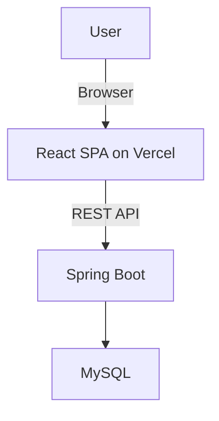

# taskFlow Fullstack Architecture Document

## Introduction

This document outlines the complete fullstack architecture for taskFlow, including backend systems, frontend implementation, and their integration. It serves as the single source of truth for AI-driven development, ensuring consistency across the entire technology stack.

### Change Log

| Date       | Version | Description                               | Author               |
| :--------- | :------ | :---------------------------------------- | :------------------- |
| 2025-11-04 | 1.0     | Initial draft based on PRD and UI/UX Spec | BMad Architect Agent |

## High Level Architecture

### Technical Summary

The architecture for taskFlow is a traditional, monolithic backend server providing a RESTful API to a modern, single-page application (SPA) frontend. The backend will be built with Java and Spring Boot, and the frontend with React.js. This approach prioritizes simplicity and rapid development for the MVP, while laying the groundwork for future scalability.

### Platform and Infrastructure Choice

- **Platform:** A combination of Vercel for the frontend is recommended.
- **Key Services:**
  - **Vercel:** For continuous deployment and hosting of the React frontend.
- **Deployment Host and Regions:** us-east-1

### Repository Structure

- **Structure:** Monorepo
- **Monorepo Tool:** npm workspaces

### High Level Architecture Diagram



### Architectural Patterns

- **Component-Based UI:** The React frontend will be built as a collection of reusable components.
- **Repository Pattern:** The backend will use the repository pattern to abstract data access logic, making it easier to manage and test.
- **RESTful API:** A standard RESTful API will be used for communication between the frontend and backend.

## Tech Stack

| Category           | Technology  | Version | Purpose                                      | Rationale                                          |
| :----------------- | :---------- | :------ | :------------------------------------------- | :------------------------------------------------- |
| Frontend Language  | TypeScript  | 5.x     | Type safety for frontend code                | Reduces bugs and improves developer experience     |
| Frontend Framework | React.js    | 18.x    | Building the user interface                  | Popular, large ecosystem, component-based          |
| State Management   | Zustand     | 4.x     | Global state management                      | Simple and unopinionated state management solution |
| Backend Language   | Java        | 21      | Backend application logic                    | Robust, mature, and performant language            |
| Backend Framework  | Spring Boot | 3.x     | Building the REST API                        | Rapid development, large community, and robust     |
| API Style          | REST        |         | Communication between frontend and backend   | Well-understood, standard for web applications     |
| Database           | MySQL       | 8.x     | Data persistence                             | Reliable, well-supported relational database       |
| Authentication     | JWT         |         | Securely authenticating users                | Stateless and widely used standard                 |
| Backend Testing    | JUnit       | 5.x     | Unit and integration testing for the backend | Standard testing framework for Java                |

## Data Models

### User

- **Purpose:** Represents a user of the application.
- **TypeScript Interface:**

  ```typescript
  interface User {
    id: string;
    username: string;

    email: string;
    role: 'ADMINISTRATOR' | 'MANAGER' | 'COLLABORATOR';
  }
  ```

### Project

- **Purpose:** Represents a project that contains tasks.
- **TypeScript Interface:**
  ```typescript
  interface Project {
    id: string;
    name: string;
    description: string;
    tasks: Task[];
  }
  ```

### Task

- **Purpose:** Represents a single task within a project.
- **TypeScript Interface:**
  ```typescript
  interface Task {
    id: string;
    title: string;
    description: string;
    priority: 'LOW' | 'MEDIUM' | 'HIGH';
    status: 'TO_DO' | 'IN_PROGRESS' | 'DONE';
    dueDate: string;
    assignee?: User;
  }
  ```

## API Specification

### REST API Specification

```yaml
openapi: 3.0.0
info:
  title: taskFlow API
  version: 1.0.0
paths:
  /api/auth/login:
    post:
      summary: Authenticate a user
      requestBody:
        required: true
        content:
          application/json:
            schema:
              type: object
              properties:
                email:
                  type: string
                password:
                  type: string
      responses:
        '200':
          description: Successful authentication
          content:
            application/json:
              schema:
                type: object
                properties:
                  token:
                    type: string
  /api/projects:
    get:
      summary: Get all projects
      responses:
        '200':
          description: A list of projects
  /api/projects/{projectId}/tasks:
    get:
      summary: Get all tasks for a project
      parameters:
        - name: projectId
          in: path
          required: true
          schema:
            type: string
      responses:
        '200':
          description: A list of tasks
```

## Unified Project Structure

```
taskflow/
├── apps/
│   ├── web/         # React Frontend
│   └── api/         # Spring Boot Backend
├── packages/
│   └── shared/      # Shared types
└── package.json
```

## Security and Performance

### Security Requirements

- **Frontend Security:**
  - Input validation on all forms.
  - Securely store JWT in `HttpOnly` cookies.
- **Backend Security:**
  - Use Spring Security for authentication and authorization.
  - Implement CORS policy to only allow requests from the frontend domain.
- **Authentication Security:**
  - Passwords must be hashed with BCrypt.
  - JWTs should have a short expiration time.

### Performance Optimization

- **Frontend Performance:**
  - Code splitting by route to reduce initial bundle size.
  - Lazy loading of images and components.
- **Backend Performance:**
  - Database query optimization and indexing.
  - Use caching for frequently accessed data.
