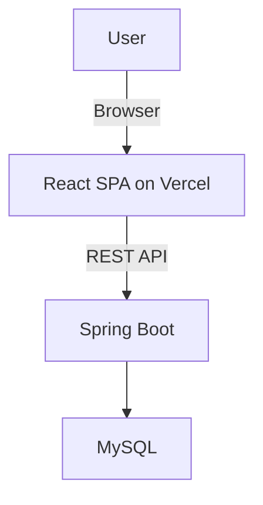

# High Level Architecture

## Technical Summary

The architecture for taskFlow is a traditional, monolithic backend server providing a RESTful API to a modern, single-page application (SPA) frontend. The backend will be built with Java and Spring Boot, and the frontend with React.js. This approach prioritizes simplicity and rapid development for the MVP, while laying the groundwork for future scalability.

## Platform and Infrastructure Choice

- **Platform:** A combination of Vercel for the frontend is recommended.
- **Key Services:**
  - **Vercel:** For continuous deployment and hosting of the React frontend.
- **Deployment Host and Regions:** us-east-1

## Repository Structure

- **Structure:** Monorepo
- **Monorepo Tool:** npm workspaces

## High Level Architecture Diagram

## Architectural Patterns

- **Component-Based UI:** The React frontend will be built as a collection of reusable components.
- **Repository Pattern:** The backend will use the repository pattern to abstract data access logic, making it easier to manage and test.
- **RESTful API:** A standard RESTful API will be used for communication between the frontend and backend.
