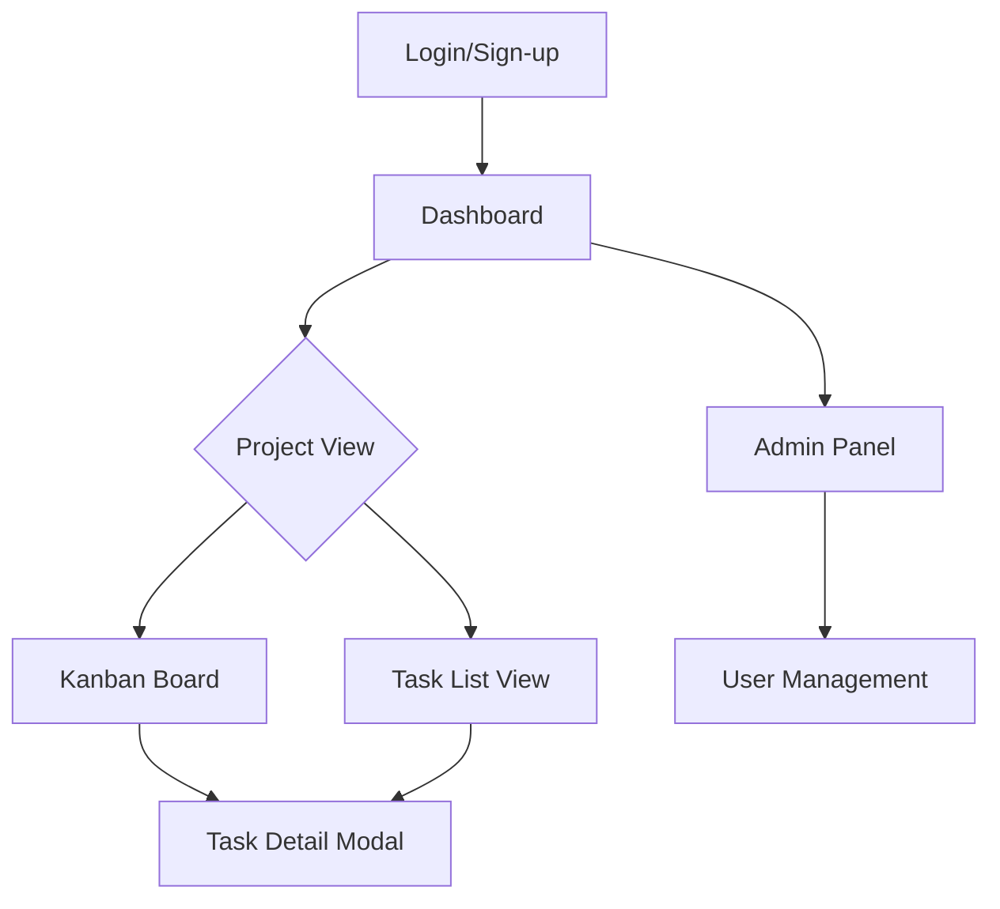
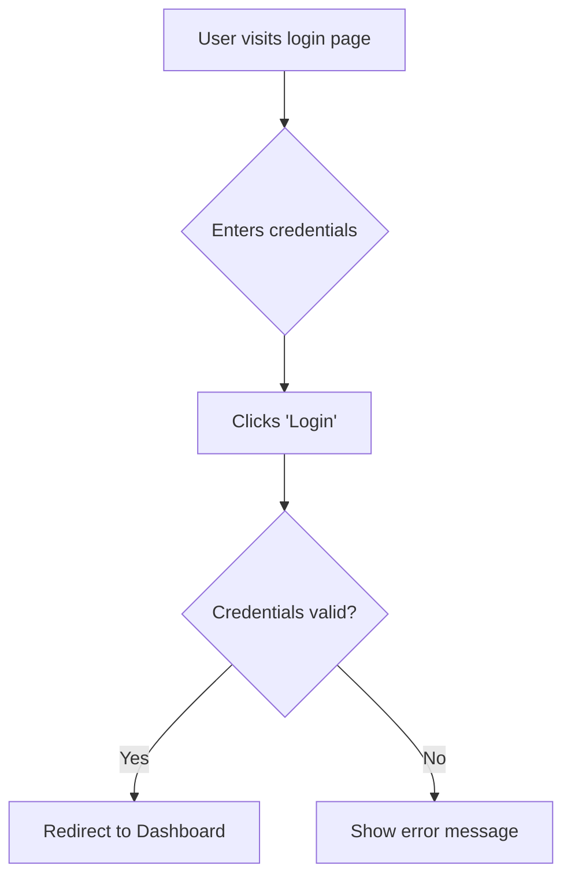
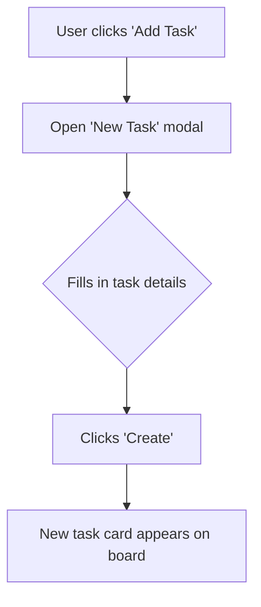
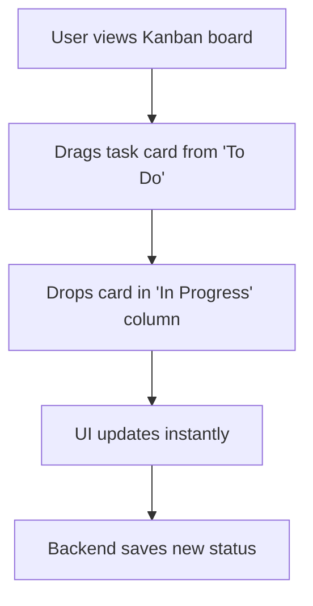

# taskFlow UI/UX Specification

## Introduction

This document defines the user experience goals, information architecture, user flows, and visual design specifications for taskFlow's user interface. It serves as the foundation for visual design and frontend development, ensuring a cohesive and user-centered experience.

### Overall UX Goals & Principles

#### Target User Personas
*   **Freelancers & Solopreneurs:** Independent professionals who need a simple, visual way to manage their workload and track progress with minimal overhead.
*   **Small Teams (2-10 members):** Collaborative teams that require a shared workspace to assign, comment on, and monitor tasks.

#### Usability Goals
*   **Ease of Learning:** A new user should be able to create a project, add a task, and move it on the Kanban board within 5 minutes of first use.
*   **Efficiency of Use:** Frequent users should be able to manage their daily tasks with minimal clicks and navigation.
*   **Clarity:** The interface should be self-explanatory, avoiding jargon and complex configurations.

#### Design Principles
1.  **Simplicity First:** Prioritize a clean, uncluttered interface that focuses the user on their tasks.
2.  **Visual Workflow:** Emphasize visual tools like the Kanban board to make workflow status immediately understandable.
3.  **Seamless Collaboration:** Make it easy for team members to communicate and stay updated on task progress.
4.  **Progressive Disclosure:** Show only necessary information by default, allowing users to access more details when needed.

### Change Log
| Date | Version | Description | Author |
| :--- | :--- | :--- | :--- |
| 2025-11-04 | 1.0 | Initial draft based on PRD | BMad UX Agent |

## Information Architecture (IA)

### Site Map / Screen Inventory

### Navigation Structure
*   **Primary Navigation:** A persistent sidebar will contain links to the Dashboard, a list of Projects, and the Admin Panel (for admins).
*   **Secondary Navigation:** Within a project, users can toggle between the Kanban Board and a Task List view.
*   **Breadcrumb Strategy:** Breadcrumbs will be used to show the user's location (e.g., `Dashboard > Project Alpha > Task #123`).

## User Flows

### User Login
*   **User Goal:** To securely access their taskFlow account.
*   **Entry Points:** Main landing page.
*   **Success Criteria:** The user is redirected to their dashboard upon successful login.

### Create New Task
*   **User Goal:** To quickly add a new task to a project.
*   **Entry Points:** "Add Task" button on the Kanban board or Task List view.
*   **Success Criteria:** The new task appears in the "To Do" column of the Kanban board.

### Update Task Status via Kanban
*   **User Goal:** To update the status of a task by moving it to a different column.
*   **Entry Points:** Kanban board view.
*   **Success Criteria:** The task's status is updated in the backend, and the change is persistent.

## Wireframes & Mockups

*   **Primary Design Files:** Detailed mockups and prototypes will be created in Figma and a link will be provided here.
*   **Key Screen Layouts:**
    *   **Dashboard:** A grid of project cards, each showing the project name and a progress bar.
    *   **Kanban Board:** Three columns ("To Do", "In Progress", "Done") with task cards. A filter bar at the top.
    *   **Task Detail Modal:** A modal overlay showing task details, comments, and history.

## Component Library / Design System

*   **Design System Approach:** A new, simple design system will be created for this project to ensure consistency.
*   **Core Components:**
    *   **Button:** Primary, secondary, and tertiary variants. States: default, hover, disabled.
    *   **Task Card:** A draggable card with task title, assignee avatar, and priority indicator.
    *   **Modal:** For creating/editing tasks and viewing details.
    *   **Input Fields:** Standard text inputs, text areas, and dropdowns for forms.

## Branding & Style Guide

### Visual Identity
*   Clean, modern, and professional. Focus on readability and ease of use.

### Color Palette
| Color Type | Hex Code | Usage |
| :--- | :--- | :--- |
| Primary | #4A90E2 | Main buttons, links, and active states |
| Secondary | #F5A623 | Secondary actions, highlights |
| Accent | #50E3C2 | Notifications and special indicators |
| Success | #7ED321 | Success messages and confirmations |
| Warning | #F8E71C | Warnings and important notices |
| Error | #D0021B | Error messages and destructive actions |
| Neutral | #4A4A4A, #9B9B9B, #FFFFFF | Text, borders, and backgrounds |

### Typography
*   **Primary Font:** Inter (a clean, modern sans-serif font)
*   **Type Scale:**
    *   H1: 32px, Bold
    *   H2: 24px, Bold
    *   H3: 18px, Semi-Bold
    *   Body: 16px, Regular
    *   Small: 14px, Regular

## Accessibility Requirements

*   **Compliance Target:** WCAG 2.1 AA
*   **Key Requirements:**
    *   **Visual:** Color contrast ratio of at least 4.5:1 for normal text. Clear focus indicators for all interactive elements.
    *   **Interaction:** Full keyboard navigation support. All interactive elements should be reachable and operable via the Tab key.
    *   **Content:** Alternative text for all meaningful images. Proper heading structure (H1, H2, H3).

## Responsiveness Strategy

### Breakpoints
| Breakpoint | Min Width |
| :--- | :--- |
| Mobile | 320px |
| Tablet | 768px |
| Desktop | 1024px |

### Adaptation Patterns
*   **Layout:** On mobile, the Kanban board will switch to a single-column view, and the main navigation will be collapsed into a hamburger menu.
*   **Content Priority:** Core content (tasks) will be prioritized on smaller screens.

## Next Steps

*   Review this specification with stakeholders.
*   Create high-fidelity mockups in Figma for all core screens.
*   Prepare for handoff to the Architect for frontend architecture planning.
